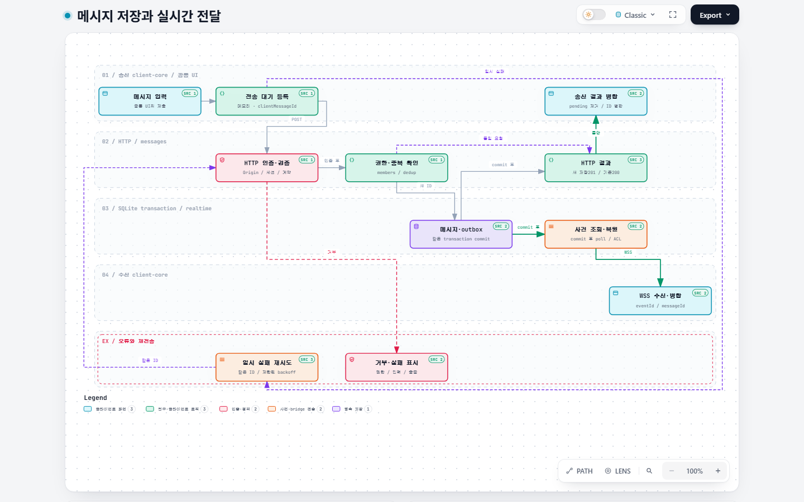

# j-messenger

같은 메일 서버 사용자끼리 개인·단체 대화하는 사설망 메신저를 목표로 한다. 현재는 개발 계정으로 Web·VM·Android의 핵심 경로를 검증한 lab이다. 실제 메일 서버가 없어 메일 인증 시험은 제외했다.

**2026-10-06: Web·VM 직접 접속·Android APK 검증 완료, 전체 재구축 진행 중.** Windows는 source/Web 번들까지 확인했고 native 실행 파일은 미검증이다. 실제 구현·환경 구축·모듈 통신·시험 및 결론은[구현 정리](docs/pmt-docs/15-implementation-guide.md)에 있다.

## 구조와 통신

| 위치 | 책임 |
| --- | --- |
| `packages/contracts` | TypeBox schema·DTO·port·오류/로그 계약 |
| `packages/client-core` | HTTP/WSS·세션·메모리 pending·같은 ID 재시도·cursor 복구 |
| `packages/client-react` | 공통 대화/파일/읽음 화면·상태·오류 표시 |
| `apps/server` | 단일 Fastify 프로세스의 기능별 모듈·SQLite WAL/transaction/outbox·worker |
| `apps/web`, `apps/desktop`, `apps/android` | 브라우저·Tauri·Android WebView/파일/수명주기 adapter |
| `deploy`, `scripts` | VM/TLS/Nginx/journal 배포·실환경 확인·Android 빌드 |

외부 명령·조회는 HTTP, 실시간 사건은 WSS다. 서버 내부는 bootstrap이 주입한 공개 TypeScript 인터페이스로 통신한다. 메시지·dedup·첨부 연결·outbox를 같은 transaction에 저장하고 commit 후 전달한다. 세션의 serverId/userId와 대화 참여 권한으로 데이터를 격리한다. 복원은 signed snapshot cursor→ready 상한→sync→buffer 병합 순서다.

코드 워크플로우는 **Archify v3.0.1의 JSON·검증된 standalone HTML**로 제공한다. HTML을 다운로드해 브라우저로 열면 경로와 고정 커밋의 `SRC` 코드 근거를 탐색할 수 있다.

- [메시지 저장·전달](docs/pmt-docs/workflows/message-delivery.html)
- [세션 복원·재연결](docs/pmt-docs/workflows/session-recovery.html)
- [파일 업로드·Android 저장](docs/pmt-docs/workflows/file-round-trip.html)
- [워크플로우 해설·재생성·검증](docs/pmt-docs/16-code-workflows.md)



## 이번에 배운 내용: outbox와 WSS

이번 구현에서 처음 이해한 두 개념을[학습 기록](docs/pmt-docs/17-outbox-wss-learning.md)에 정리했다.

- **outbox:** 전달해야 할 변화를 DB에 남기는 기록. 서버 코드가 메시지와 사건을 같은 transaction에 저장해 저장 후 전달 기록이 빠지는 일을 막는다.
- **WSS:** 연결을 유지하며 사건을 전달하는 TLS 암호화 WebSocket. 우리는 발송·조회는 HTTPS, 실시간 수신 사건은 WSS로 나눴다.
- **250ms 반복 확인의 주체는 서버 realtime 모듈**이다. SQLite는 저장을 담당하고, 앱·웹은 열린 WSS 연결에서 사건을 받는다.
- 앱은 받은 메시지를 번호로 병합하고 재연결 시 sync로 누락을 복구한다. 저장·전송·수신·읽음은 각 단계이며 OS 알림은 현재 비활성인 별도 기능이다.

상세 기록에는 용어·구현 순서·실제 코드·공식 근거와 Archify 도식 링크를 함께 두었다.

## 로컬 실행

Node 22.18 이상이 필요하다. 저장소 루트에서 다음 순서로 실행한다.

```powershell
npm ci
npm run build
$env:NODE_ENV='development'
$env:AUTH_MODE='development-fixed'
$env:HOST='127.0.0.1'
$env:PUBLIC_ORIGIN='http://127.0.0.1:3000'
node apps/server/dist/main.js
```

브라우저에서 `http://127.0.0.1:3000`을 연다. 루트 cwd에서 실행해야 기본 데이터/Web 경로가 맞는다. 개발 계정은 `dev-a`의 `alice`·`bob`·`carol`, `dev-b`의 `mallory`, 암호는 `dev-only`다. 설정 예시는 `deploy/local.env.example`이며 자동으로 읽지 않는다.3001은 사용하지 않는다.

메시지 본문5일·첨부14일, 개당5,000,000 bytes·lab 서버별2GB다. 원문 메시지/파일·비밀번호·cookie/token은 운영 로그에 남기지 않는다. VM의 JSON journal은 최대14일·256MiB·최소 여유1GiB 정책을 사용한다. 로컬 데이터·APK·원문 로그·실환경 env·키는 Git에서 제외한다.

```powershell
npm run check
npm run test:e2e
npm run build --workspace=@j-messenger/desktop
```

브라우저 시험은 먼저 `npm run build`를 실행하고 설치된 Edge 또는 Chrome이 있는 환경에서 진행한다. Windows 화면 번들과 네이티브 실행 파일은 별도다. 네이티브 빌드는 Rust·Microsoft C++ Build Tools가 준비된 뒤 `npm run bundle --workspace=@j-messenger/desktop`으로 수행한다. 현재 네이티브 바이너리·설치 패키지·앱 프로세스 종료 상태 알림은 검증되지 않았다. [실행 현황](docs/pmt-docs/12-execution-status.md)에 제한과 근거를 기록한다.

## VM 설정

`npm run setup:vm`에서 **VM 이름·사설IP·HTTP/HTTPS·외부/내부 포트·HTTP redirect·허용CIDR**를 선택한다. 공통 프로필과 검토용 plan·Nginx/env·게스트 스크립트를 생성하며 현재VM을 자동 변경하지 않는다.

```powershell
npm run setup:vm
# 저장한 설정으로 반복 생성
node scripts/setup-vm.mjs --config deploy/vm-profile.example.json --output .tools/vm-setup/my-plan
```

적용 순서는 **계획 확인 → Hyper-V/OS·IP 준비 → SSH/앱 계정 → TLS → release 배포 → 웹 설정 적용 → 접속 검증**이다. 새 VM 생성은 관리자명령, 앱/웹 적용은 지정게스트명령으로 수행한다. 구체명령과실패복구·인증서신뢰·선택값의 의미는[VM 설정 방법론](docs/pmt-docs/18-vm-setup-guide.md)을 따른다.

현재lab의실측 예시는 `j-messenger-lab`의 **`https://10.77.0.10/`**, VM Nginx443→같은VM Node TLS3443이다. PC 중계없이 업무데이터는VM에 있다. HTTPS 개발CA는신뢰등록이필요하고 HTTP는암호화없는개발시험용이다. [기존VM 실행 기록](docs/pmt-docs/13-vm-deployment.md)과[새설정방법](docs/pmt-docs/18-vm-setup-guide.md)을 구분한다.

Android는 기존 Web 화면을 APK 안에 포함하고 VM의 HTTPS·WSS에 직접 연결한다. Android Studio JDK·SDK와 검증된 공개 lab CA가 준비된 환경에서 다음 명령으로 debug APK를 만들고 지정된 `Pixel_10`에 설치·시험한다. 산출물은 `apps/android/app/build/outputs/apk/debug/app-debug.apk`다. [Android 실행 기록](docs/pmt-docs/14-android-web-app.md)에 조건과 결과를 기록한다.

```powershell
./scripts/build-android.ps1 -Test
```

| 문서 | 내용 |
| --- | --- |
| [AGENTS.md](AGENTS.md) | 현재 작업 규칙과 필수 경계 |
| [재구축 설계](docs/pmt-docs/README.md) | 요구사항, 폴더·기술, 모듈, 통신, 확장, 코드·운영 기준 |
| [전환 계획](docs/pmt-docs/07-rebuild-plan.md) | 단계별 산출물·검증·기존 자산 처리 |
| [VM 실행 기록](docs/pmt-docs/13-vm-deployment.md) | 실제 lab 배포·TLS·로그·재부팅·접속 조건 |
| [Android 실행 기록](docs/pmt-docs/14-android-web-app.md) | Web APK·Pixel10·VM 연결·파일·복구 검증 |
| [구현·환경·통신·결론](docs/pmt-docs/15-implementation-guide.md) | 현재 작업 정리·재현 절차·모듈별 입출력·기술 방식·시험 한계 |
| [Archify 코드 워크플로우](docs/pmt-docs/16-code-workflows.md) | 수정 가능한 JSON·인터랙티브 HTML·소스 근거·검증 요약 |
| [이번에 배운 outbox·WSS](docs/pmt-docs/17-outbox-wss-learning.md) | 쉬운 개념·실제 구현·서버/앱 역할·수신과 알림·공식 근거 |
| [VM 설정 방법론](docs/pmt-docs/18-vm-setup-guide.md) | 이름/IP/HTTP 선택·Hyper-V·게스트·TLS·배포·웹 적용·검증 |
| [기존 환경](docs/env.md) | 과거 호스트·WSL·VM 실측, 재사용 전 확인 |
| [기존 검증 기록](docs/verification.md) | 환경 구축 시험 이력 |

## 테스트와 결론

| 검증 | 기록된 결과 |
| --- | --- |
| 공통·서버·UI·VM 설정 | 139개 시험(기존128·VM 설정11), 타입·lint·소유 경계 통과 |
| VM | HTTPS/WSS16개·실제 브라우저, Node service 재부팅 영속1개 통과 |
| Android Pixel_10 | 실제2개·127.238초: 송수신·복구·IME·회전·Back·TXT32-byte 저장 전체 일치 |
| 로그 | 마지막 VM910건의 금지 field/시험 원문/비밀번호/drop0, Android app crash0 |

핵심 대화·파일 경로는 lab에서 확인했다. 실제 메일·Windows native·실물/다른 Android·한글 IME별 조합·Android5MB 왕복·종료 푸시·운영 부하·전체 재해 복구는 남아 있다. 코드 커밋, VM의 활성 release, APK checksum은[구현 정리](docs/pmt-docs/15-implementation-guide.md)에서 구분한다.

이전 `web/`, `docs/plan.md`, `docs/tasks/`, `.ctx/`는 이력이며 현재 작업 큐가 아니다.
