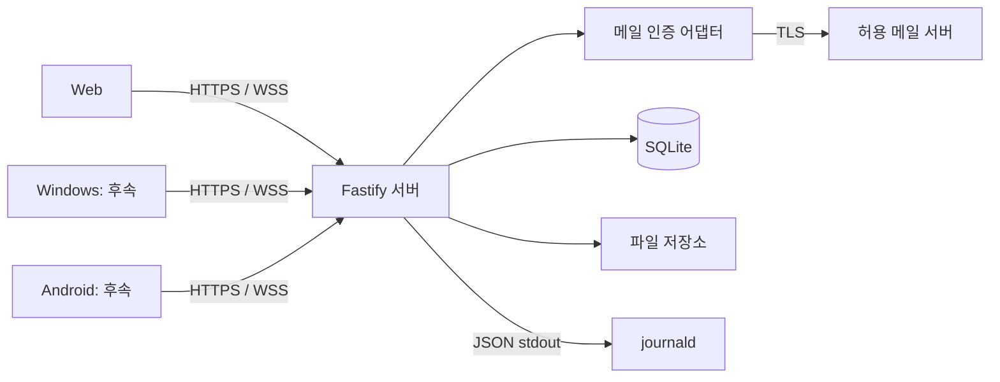

# 구조와 기술 선택

## 배치 단위

초기는 **모듈형 단일 서버 + 단일 SQLite + 정적 웹**이다. 서버 안에서 기능을 나누고, 기능마다 별도 서버나 DB를 만들지 않는다. 1 vCPU·RAM 1 GiB·디스크 20 GiB는 [기존 환경의 기준](../env.md)이며 새 구조의 성능 보장은 [실측](07-rebuild-plan.md)으로 판정한다.



## 포함 기술

아래는 이번 재구축의 선택이다. 패치 버전은 구현 착수 시 공식 호환표·보안 공지와 실제 VM을 확인해 정확한 버전 및 lockfile로 고정한다. 최신 버전을 자동 설치하지 않는다.

| 영역 | 선택 | 목적·적용 시점 |
| --- | --- | --- |
| 저장소 | npm workspaces, 루트 lockfile 하나 | `apps/*`, `packages/*` 의존·검증 통합 |
| 런타임 | Node 22.18 이상 22.x 호환, Windows Node 24 병행 검증 | 기존 VM 계열 유지. 지원 종료 전에 LTS 전환 검토 |
| 언어·빌드 | TypeScript strict, ESM, 서버·공유 패키지는 `tsc`로 JS 산출 | 운영은 `dist` 실행. 소스 직접 실행 규칙 대체 |
| 웹 | React 19 + Vite 7 + CSS Modules | 화면·상태를 기능별 컴포넌트로 분리. SSR 없음 |
| 서버 | Fastify 5 | 라우팅·검증·오류·로그를 일관되게 적용 |
| 계약 | TypeBox + `@fastify/type-provider-typebox`, `@fastify/swagger` | JSON Schema·TS 타입·OpenAPI를 한 계약에서 생성 |
| HTTP 부속 | `@fastify/cookie`, `@fastify/static`, `@fastify/rate-limit` | 세션·정적 웹·요청 제한. Fastify 5 호환 버전 고정 |
| 실시간 | `@fastify/websocket` / ws | 서버 변경 알림. 업무 쓰기는 HTTP로 통일 |
| DB | `node:sqlite`, SQL migration, WAL | 별도 DB 서비스 없이 영속화. ORM 없음 |
| 메일 | `MailAuthenticator` + ImapFlow 어댑터 | U01이 IMAP/TLS 인증을 지원할 때만 활성화 |
| 파일 | 로컬 비공개 디렉터리 + `@fastify/multipart` | 2차에 스트리밍 업로드, 용량 제한 |
| 로그 | Fastify의 Pino + systemd journal | JSON 로그 저장·회전. 초기 외부 수집 서버 없음 |
| 검증 | Vitest, React Testing Library, Playwright, ESLint·Prettier | 단위·계약·화면·실브라우저·의존 경계 검사 |
| Windows | Tauri 2 + React 화면 재사용 | 3차 기본안. Rust는 OS 연결 기능에 한정 |
| Android | Kotlin + Jetpack Compose | 3차 기본안. OS 수명주기·권한 처리를 앱 안에 격리 |

기술 근거: [공식 자료 S01~S14](08-official-references.md). `node:sqlite`는 참조한 Node 22 문서에서 개발 중 API이고 `DatabaseSync`는 동기식이다. DB 어댑터로 격리하고 짧은 쿼리·배치 제한을 적용하며 경고를 일괄 숨기지 않는다. React/Tauri 도입 자체가 종료 알림을 보장하지 않는다.

초기 DB 연결은 `journal_mode=WAL`, `foreign_keys=ON`, `synchronous=FULL`, busy timeout 1초를 명시한다. 한 서버 프로세스가 쓰기를 소유하고 로컬 디스크만 사용한다. 변경 배치는 짧게 끝내고 잠금 경합은 503 재시도로 처리한다. WAL 크기·checkpoint는 운영 지표로 확인한다.

## 목표 폴더 트리

아직 없는 경로는 구현 단계에서 만든다. 후속 모듈의 빈 파일을 미리 대량 생성하지 않는다.

```text
j-messenger/
├─ AGENTS.md
├─ README.md
├─ package.json / package-lock.json / tsconfig.base.json
├─ apps/
│  ├─ server/
│  │  ├─ src/
│  │  │  ├─ main.ts                 # 설정·시작·종료
│  │  │  ├─ bootstrap/              # 의존 주입·라우트/작업 등록
│  │  │  ├─ modules/
│  │  │  │  ├─ identity/           # 인증·사용자·세션
│  │  │  │  ├─ conversations/      # 대화·참여 권한
│  │  │  │  ├─ messages/           # 메시지·중복 방지
│  │  │  │  ├─ realtime/           # 연결·이벤트 전달
│  │  │  │  ├─ files/              # 후속: 첨부·다운로드
│  │  │  │  ├─ receipts/           # 후속: 읽음 위치
│  │  │  │  ├─ retention/          # 후속: 보존 정책·삭제 작업
│  │  │  │  ├─ notifications/      # 후속: 기기·알림 전달
│  │  │  │  └─ audit/              # 관리자 변경 감사
│  │  │  └─ platform/              # DB·설정·로거·시계·이벤트 저장
│  │  ├─ migrations/               # 순번 SQL, 적용 이력
│  │  └─ test/                     # 통합·저장소·모듈 경계
│  ├─ web/
│  │  ├─ src/app/                  # 웹 진입·라우팅·조합
│  │  └─ test/
│  ├─ desktop/                     # 후속: Tauri 진입·src-tauri
│  └─ android/                     # 후속: Gradle·Compose·기능 패키지
├─ packages/
│  ├─ contracts/src/               # HTTP DTO·스키마·이벤트·오류 코드
│  ├─ client-core/src/             # API·세션 추상화·재접속·정규화 상태
│  ├─ client-react/src/            # React 기능 화면·hooks·CSS
│  │  └─ features/                 # auth·directory·conversations·chat 등
│  └─ test-kit/src/                # test 전용 fixtures·계약용 모의 서버
├─ tests/e2e/                      # 여러 클라이언트·재시작·격리 시나리오
├─ scripts/                        # build·check·계약 생성·배포 보조
├─ deploy/                         # systemd·설정 예시·운영 절차
└─ docs/
   ├─ pmt-docs/                    # 현재 설계 기준
   ├─ plan.md / tasks/             # 구 설계 이력
   └─ env.md / vm-runbook.md        # 기존 환경 기록
```

`client-react`가 Web·Windows 공통 화면을 소유하고 두 앱은 진입점과 플랫폼 어댑터만 둔다. Android는 TypeScript를 가져오지 않고 OpenAPI·이벤트 스키마·공통 테스트 벡터를 재사용한다.

## 의존 방향

```text
apps/web, apps/desktop → client-react → client-core → contracts
apps/server → contracts
server bootstrap → modules → 각 모듈의 port → platform 어댑터
apps/android → 생성한 Kotlin 계약 모델
```

공유 패키지는 `apps/*`를 import하지 않는다. `contracts`에는 서버 DB 모델·React·Node 전용 API를 넣지 않는다. 모듈 간에는 공개 `index.ts`의 기능 인터페이스만 사용하며, 상대 repository·내부 폴더·테이블을 직접 참조하지 않는다. 서버 내부에는 HTTP 호출·서비스 디스커버리·분산 메시지 브로커를 두지 않는다.
