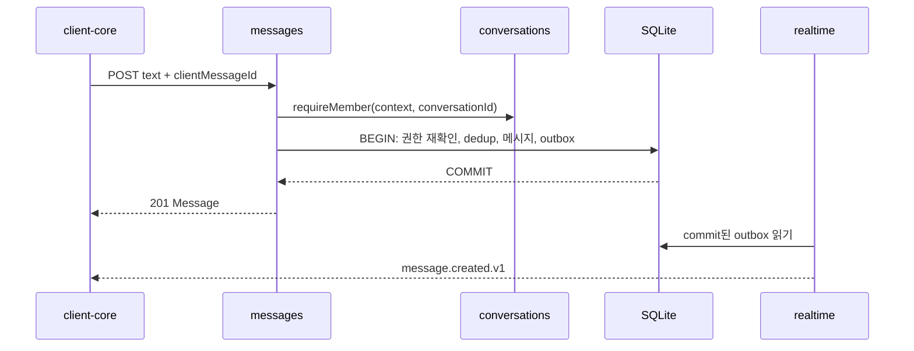

# 통신 계약과 동작 레퍼런스

> [최신 실행 정책](12-execution-status.md)에 따라 메시지 본문 만료와 첨부 만료를 분리한다. 만료된 본문은 삭제 표시와 유효 첨부 참조만 제공하며, 메일 연동 시험·Android 구현/검증은 이번 범위에서 제외한다.

## 통신 경계

| 경계 | 방식 | 규칙 |
| --- | --- | --- |
| 클라이언트 → 서버 | HTTPS `/api/v1` JSON | 조회·업무 명령. 첨부만 multipart/stream |
| 서버 → 클라이언트 | WSS `/api/v1/events` | commit된 변경 통지. 메시지 쓰기 명령은 수신하지 않음 |
| 서버 내부 | 주입한 module API 직접 호출 | 인증 문맥·타입 전달, 상대 테이블 직접 접근 금지 |
| commit 후 작업 | SQLite event_outbox·작업 테이블 | 메모리 알림은 깨우기 용도, 재시작 시 DB에서 복구 |
| 서버 → 메일 | 허용 endpoint의 TLS 인증 | 제품별 어댑터, timeout, 인증서 검증 |
| 서버 → OS 푸시 | 후속 provider | U04 확정 후 도입, 저장 성공과 별도 상태 |

## HTTP 계약

성공은 `{ "data": ... }`, 목록은 `{ "data": [...], "page": { "nextCursor": null }, "snapshotCursor": "..." }`로 감싼다. snapshotCursor는 목록을 읽은 DB snapshot 시점의 이벤트 위치다. 실패는 `{ "error": { "code": "not_found", "message": "...", "requestId": "..." } }`다. UI는 code를 한국어로 변환하며 raw 예외를 표시하지 않는다.

| API | 입력·결과 요점 | 단계 |
| --- | --- | --- |
| `GET /health/live`, `GET /health/ready` | 프로세스 생존 / DB·migration·저장소 준비. 비밀·내부 경로 응답 금지 | S |
| `GET /api/v1/servers` | 허용 서버 ID·표시명·로그인 별칭만 반환 | S |
| `POST /api/v1/session` | `{ serverId, username, password }` → 사용자·만료 시각, cookie 발급 | S |
| `GET /api/v1/me`, `DELETE /api/v1/session` | 현재 세션 확인 / 폐기·소켓 종료 | S |
| `GET /api/v1/users?cursor=...&limit=50` | 같은 서버의 등록 사용자, 최대 100명씩 | S |
| `GET /api/v1/conversations?cursor=...&limit=50` | 참여 대화, 최근 메시지 요약·snapshotCursor | S |
| `POST /api/v1/conversations` | `{ kind, memberIds, title?, clientRequestId }` → 개인/단체 대화 | S |
| `GET /api/v1/conversations/:id/messages` | `before` 또는 `after` 중 하나, `limit=50`, 최대 100; ID 오름차순 응답 | S |
| `POST /api/v1/conversations/:id/messages` | `{ clientMessageId, text, fileIds? }` → 생성 201 / 동일 재시도 200 | S/F |
| `GET /api/v1/sync?after=...&through=...&limit=100` | 권한 있는 변경과 `nextCursor`, `hasMore`; 최대 500개 스캔 | S |
| `POST /api/v1/conversations/:id/files` | 제한된 스트림 → 준비 완료 파일 ID. 아직 메시지에는 미연결 | F |
| `GET /api/v1/files/:id/content` | 현재 참여자에게 attachment 다운로드 | F |
| `PUT /api/v1/conversations/:id/read` | `{ lastReadMessageId }` → 기존 값 이상으로만 갱신 | F |
| `GET /api/v1/conversations/:id/read` | 참여자의 읽음 위치·snapshotCursor, 재접속 시 상태 복구 | F |
| `GET/PUT /api/v1/admin/retention` | 현재 서버 관리자만 보존 정책 조회·변경 | F |
| `GET /api/v1/admin/audit?cursor=...` | 현재 서버 관리자에게 해당 서버 감사 기록 | F |
| `POST/DELETE /api/v1/devices...` | 기기 등록·해제, 자세한 경로·payload는 3차 계약에서 확정 | F |

기본 오류: 400 `bad_request`, 401 `unauthorized`, 403 `forbidden`, 404 `not_found`, 409 `conflict`, 410 `sync_reset_required`/`message_expired`, 413 `too_large`, 429 `rate_limited`, 500 `internal`, 503 `unavailable`. 타 서버 또는 대화 비참여자는 404로 통일한다. 로그인 자격 증명 실패는 계정 존재 여부를 구분하지 않는 401이며, 메일 서버 접속 장애는 자격 증명 실패와 구분한 일반적인 503으로 처리한다.

## 인증과 버전

- 브라우저는 같은 origin의 HttpOnly·Secure·SameSite=Strict cookie를 쓴다. 32바이트 난수 토큰, DB에는 SHA-256 hash만 저장한다. 초기 만료 설정 범위는 1~7일, 기본 7일이며 매 요청·소켓 heartbeat에서 폐기·만료를 확인한다.
- cookie를 사용하는 변경 요청·WebSocket handshake는 허용 Origin을 정확히 확인하고 누락·`null`도 거부한다. 로그인도 검사한다. 개발 환경은 Vite proxy를 사용하고 운영 CORS wildcard는 허용하지 않는다.
- 네이티브 앱 단계에는 별도 `/api/v1/native/session`으로 기기별 opaque bearer 세션을 발급한다. 같은 세션 검증기를 사용하며 cookie와 bearer 동시 제출은 거부한다. 네이티브 WS는 Authorization 헤더, 브라우저 WS는 cookie만 허용하고 query string에 토큰을 넣지 않는다.
- Windows bearer는 Rust 측 OS 자격 증명 저장소, Android는 OS 보호 저장소 뒤의 어댑터가 다룬다. Web localStorage에는 인증 토큰을 저장하지 않는다. 메일 비밀번호는 어느 클라이언트에도 저장하지 않는다.
- `contracts`의 스키마가 런타임 입력·출력과 생성 OpenAPI의 원천이다. 선택 필드 추가는 v1에 가능하고, 삭제·의미 변경은 v2 계약 및 전환 기간을 문서화한다. 이벤트도 `message.created.v1`처럼 버전을 포함한다.

## 이벤트와 누락 복구

```json
{
  "eventId": "1042",
  "type": "message.created.v1",
  "occurredAt": "2026-10-02T03:00:00.000Z",
  "conversationId": "7",
  "data": {
    "id": "83", "conversationId": "7", "senderId": "2",
    "clientMessageId": "55a827ef-88ac-4201-9e94-539bec429f74",
    "text": "안녕하세요", "createdAt": "2026-10-02T03:00:00.000Z"
  }
}
```

예시는 생성 이벤트의 전송 DTO다. DB outbox에는 본문을 보관하지 않는다. 후속 타입은 `conversation.created.v1`, `receipt.updated.v1`, `message.deleted.v1`, `file.deleted.v1`, `retention.updated.v1`이다. 이벤트마다 수신 대상을 명시하고 정책 변경은 해당 서버 관리자에게만 전달한다.

1. 소켓 인증 후 구독을 등록하고, 그 시점의 상한 cursor `H`를 `ready`로 보낸다. 같은 실행 구간에서 등록·상한 확정을 수행하여 틈을 만들지 않는다. 이후 `H` 초과 이벤트는 클라이언트가 임시 버퍼에 둔다.
2. 이전 cursor `C`가 있으면 HTTP sync로 `(C, H]`를 끝까지 페이지 조회한다. 서버는 현재 서버·참여 권한으로 필터링하며, `nextCursor`는 **마지막 반환 행이 아니라 마지막 스캔 위치**다. 숨겨진 이벤트가 있어도 정지하지 않는다.
3. sync 결과를 적용한 뒤 버퍼의 이벤트를 ID 순서로 적용한다. live 이벤트 ID는 중복 제거용이며, 이것만 보고 영속 복구 cursor를 앞당기지 않는다. 복구 cursor는 sync가 확인한 연속 구간만 전진시킨다.
4. 첫 접속·7일 보존을 지난 cursor는 전체 재동기화한다. 서버는 만료 cursor에 410을 반환한다. 클라이언트는 캐시를 비우고 구독 후 대화 목록·현재 화면의 메시지를 다시 조회한다. 각 조회의 snapshotCursor 이하 버퍼는 그 조회에 재적용하지 않고, 더 최신 이벤트만 병합한다. 과거 기록은 필요할 때 HTTP로 가져온다.
5. 메시지 본문이 보존 삭제된 생성 이벤트는 삭제 사실로 반환한다. 이미 삭제한 자료가 오래된 이벤트로 되살아나지 않게 entity별 최신 eventId와 tombstone을 병합한다.
6. 소켓 연결 중에도 30초마다, 창 활성화 때 sync로 확인한다. reconnect는 1·2·4초에서 최대 30초 지수 지연과 jitter를 사용한다. 401은 재시도 루프 대신 재로그인으로 전환한다.

cursor는 서버가 발급하는 서명된 불투명 값으로 사용자·serverId·위치·만료를 묶는다. 임의 cursor 조작이나 다른 사용자의 cursor 재사용을 거부한다. 페이지 조회 중 상한 `through`는 고정한다. HTTP 스냅샷과 이벤트 ID는 같은 DB 트랜잭션 시점에서 산출한다.

전달은 중복될 수 있으며 클라이언트가 `eventId`·메시지 ID로 합친다. 소켓 큐가 1 MiB를 넘거나 heartbeat 응답이 60초 없으면 연결을 닫고 sync로 복구한다. 실패한 전달 때문에 메시지 commit을 되돌리지 않는다. 초기 값은 성능 시험 후 조정한다.

## 동작 레퍼런스 A: 로그인

```text
auth 화면 → client-core.login → identity route
→ 허용 serverId 해석·요청 제한 → MailAuthenticator(TLS 인증)
→ identity: 사용자 upsert + 세션 hash 저장 → cookie·사용자 응답
→ client-core: 이전 서버 상태 초기화 → 대화 조회·WSS 연결
```

메일 연결은 트랜잭션 밖에서 실행하고 전체 timeout을 둔다. 비밀번호·메일 세션은 인증 후 폐기한다. `admin`이라는 이름이나 로그인 성공만으로 관리자 권한을 부여하지 않는다.

## 동작 레퍼런스 B: 메시지 전송



클라이언트는 전송 시작 전에 UUID를 한 번 만들고 응답 유실·timeout 재시도에도 유지한다. DB 실패면 응답·이벤트 모두 성공으로 표시하지 않는다. commit 직후 프로세스가 종료되어도 outbox와 sync로 복구한다. HTTP 응답과 이벤트의 도착 순서는 보장하지 않으며 하나의 메시지로 병합한다. 만료된 dedup tombstone 재시도는 410이고 새 전송으로 자동 바꾸지 않는다.

자동 재시도는 최초 시도부터 최대 7일 안에서만 허용하고, 그 이후나 로그아웃 뒤에는 미전송 상태를 복원해 자동 송신하지 않는다. 본문 삭제 후 중복 방지는 30일 tombstone 보존 범위까지다. 이 기간을 바꿀 때 세션·클라이언트 재시도 한도도 함께 검토한다.

## 동작 레퍼런스 C: 파일·읽음·보존

| 흐름 | 호출·상태 순서 | 실패 처리 |
| --- | --- | --- |
| 파일 | files가 권한·크기 검사 → 임시 스트림 → 임의 키로 저장 → `ready` → messages가 같은 트랜잭션에서 파일 소유·대화 확인 후 연결 | 업로드 중단은 임시파일 정리. 24시간 미연결 파일 수거. 준비되지 않은 파일은 전송·다운로드 금지 |
| 읽음 | 화면에 실제 보인 최대 메시지 → receipts.advance → 참여·메시지 확인 → `max(old, new)` 저장·outbox | 느린 기기의 옛 값으로 읽음 위치를 후퇴시키지 않음 |
| 보존 | 관리자 정책 변경+audit commit → retention 배치 → messages.purgeExpired·files.scheduleDelete → 본문 삭제·접근 차단+삭제 이벤트 commit → 파일 worker 삭제 | 파일 삭제 실패는 작업을 유지하여 재시도. 이미 없는 파일은 성공. 재시작 뒤 이어감 |

파일 metadata 상태는 `uploading → ready → attached → deleting → deleted`다. metadata와 디스크의 원자성은 가정하지 않는다. 파일 생성 전 intent를 기록하고 고아 파일·누락 파일을 주기적으로 대조한다. 한 파일은 같은 사용자·대화의 한 메시지에만 연결한다.

retention은 ID 순으로 최대 100건씩 짧게 처리하고, 변경 시 기존 자료에도 새 정책을 적용한다. 다음 배치가 정책 버전을 다시 읽는다. 메시지 삭제 시 첨부도 삭제하며, 파일 보존이 더 짧으면 첨부만 먼저 만료한다. 삭제된 본문·파일은 sync·알림 재시도로 재전송하지 않는다.
